# Kế Hoạch Triển Khai 5 Cải Tiến Lớn: Mindful Social Tracker Extension

Tài liệu này tổng hợp toàn bộ giải pháp kỹ thuật và kế hoạch thực thi cho 5 nhóm cải tiến đã được thống nhất thông qua phỏng vấn chi tiết.

---

## 🏗️ Tổng Quan Kiến Trúc Nâng Cấp

```mermaid
flowchart TD
    subgraph S1["1. Giới hạn riêng từng nền tảng"]
        YT["YouTube: Shorts & Video dài"]
        FB["Facebook: Reels, Feeds & Video dài"]
        StorageThresh["app_config.thresholds (youtube & facebook riêng biệt)"]
        YT --> StorageThresh
        FB --> StorageThresh
    end

    subgraph S2["2. Intent & Session Limiter"]
        AnchorAvatar["Ảnh Người Thương làm Avatar đối thoại"]
        SessionChoice["Chọn phiên: 5p / 10p / 15p / 20p / 30p"]
        Countdown["Timer đếm ngược phiên"]
        ExpiredModal["Hết giờ -> Modal Pet & Người thương"]
        ExtendAction["Gia hạn (+5p: -10⚡, +10p: -20⚡, +15p: -35⚡)"]
        AnchorAvatar --> SessionChoice --> Countdown --> ExpiredModal --> ExtendAction
    end

    subgraph S3["3. Pet Puppet 3 Cảm Xúc"]
        UploadSlots["3 Ô tải ảnh: Happy (≥70⚡), Neutral (40-69⚡), Sad (<40⚡)"]
        FallbackEngine["Fallback mượt mà nếu chỉ có 1 ảnh"]
        PetRender["PetEngine render mặt tương ứng theo Mood"]
        UploadSlots --> FallbackEngine --> PetRender
    end

    subgraph S4["4. Pet trong Thông Báo & Nhắc Nhở"]
        TierLight["Cảnh báo nhẹ (F5 spam, Mốc 1) -> Pet Toast góc màn hình"]
        TierHeavy["Nhắc nhở lớn (Hết phiên, Mốc 2/3) -> Pet Center Modal"]
    end

    subgraph S5["5. Năng Lượng Pet Đa Tầng Kỷ Luật"]
        EnergyBar["Năng lượng Pet (0 - 100⚡)"]
        LowWarn["<15⚡: Kích hoạt cưỡng chế Grayscale Mode"]
        ZeroWarn["0⚡: Khóa hoàn toàn nút Gia Hạn + Reset Streak ngày"]
        Recovery["Hồi phục: Pomodoro (+15⚡), Video học tập hữu ích (+10⚡)"]
        EnergyBar --> LowWarn
        EnergyBar --> ZeroWarn
        Recovery --> EnergyBar
    end
```



---

## 📋 Chi Tiết Từng Hạng Mục Cải Tiến

### 1. Hệ Thống Giới Hạn Riêng Cho Từng Nền Tảng
- **Cấu trúc lưu trữ mới (`app_config.thresholds`):**
  ```json
  {
    "thresholds": {
      "youtube": {
        "shorts": { "m1": 15, "m2": 30, "m3": 45 },
        "long": { "m1": 3, "m2": 5, "m3": 8 }
      },
      "facebook": {
        "reels": { "m1": 15, "m2": 30, "m3": 45 },
        "feeds": { "m1": 20, "m2": 40, "m3": 60 },
        "long": { "m1": 2, "m2": 4, "m3": 6 }
      }
    }
  }
  ```
- **Tương thích ngược (Backward Compatibility):**
  - Trong [`storage.js`](file:///f:/A-PROJECTS/social-media-tracker-extension/src/utils/storage.js), hàm `loadAppData()` sẽ kiểm tra cấu trúc cũ dạng `{ shorts, long }` và tự động migrate sang cấu trúc nền tảng mà không làm mất dữ liệu của người dùng.
- **Giao diện cấu hình ([`popup.html`](file:///f:/A-PROJECTS/social-media-tracker-extension/popup.html) & [`popup.js`](file:///f:/A-PROJECTS/social-media-tracker-extension/popup.js)):
  - Tách các ô nhập M1, M2, M3 riêng cho YouTube (Shorts & Video dài) và Facebook (Reels, Feeds, Video dài).

---

### 2. Intent Check-in & Session Limiter với Ảnh Người Thương
- **Thiết kế giao diện Modal:**
  - Avatar tròn của người thương (lấy từ `emotionalAnchorImage`, fallback sang avatar Pet nếu chưa có ảnh).
  - Lời thoại ngọt ngào/chân thành: *"Chào bạn! Hôm nay bạn vào lướt mạng xã hội vì mục tiêu gì thế?"*
  - Ô nhập mục tiêu ngắn hạn (tự động gợi ý từ khóa học tập).
  - Thanh chọn phiên lướt nhanh: **[5 phút]**, **[10 phút]**, **[15 phút]**, **[20 phút]**, **[30 phút]**.
- **Cơ chế đếm ngược & Thông báo hết giờ:**
  - Khi bắt đầu phiên, lưu `session_start_time` và `session_duration_minutes` vào `sessionStorage`.
  - Timer ngầm kiểm tra mỗi 5s. Khi hết giờ:
    - Kích hoạt **Modal Hết Giờ Phiên Lướt** với Pet xuất hiện ở giữa màn hình.
    - Lựa chọn 1: `🛑 Đóng Tab & Hoàn Thành Phiên` (thưởng `+5⚡` năng lượng cho Pet).
    - Lựa chọn 2: `⏱️ Gia Hạn Thêm` (tối đa 2 lần/phiên):
      - +5 phút: trừ `10⚡`.
      - +10 phút: trừ `20⚡`.
      - +15 phút: trừ `35⚡`.
    - Nếu năng lượng Pet $< 10\text{⚡}$ hoặc đã gia hạn đủ 2 lần: Nút gia hạn bị vô hiệu hóa (`disabled`) kèm thông báo *"Pet của bạn đã quá kiệt sức, hãy nghỉ ngơi thôi!"*.

---

### 3. Pet Puppet Mode Với 3 Ảnh Biểu Cảm
- **Cấu trúc lưu trữ (`petConfig`):**
  ```json
  {
    "mode": "puppet",
    "uploadedImageBase64": "...", // Giữ làm fallback
    "uploadedPuppetImages": {
      "happy": "data:image/jpeg;base64,...",
      "neutral": "data:image/jpeg;base64,...",
      "sad": "data:image/jpeg;base64,..."
    }
  }
  ```
- **Giao diện Puppet trong Popup:**
  - 3 khung xem trước tròn kèm nhãn:
    - 🌸 **Vui vẻ (Happy $\ge$ 70⚡)**
    - 🍃 **Bình thường (Neutral 40-69⚡)**
    - 🌧️ **Mệt mỏi / Buồn (Sad < 40⚡)**
  - Tải ảnh qua File hoặc URL, tự động nén tròn bằng Canvas $120\times 120\text{px}$ để tiết kiệm dung lượng `chrome.storage.local`.
  - Fallback thông minh: Nếu chỉ tải 1 ảnh, tự động sao chép sang cả 3 khung hoặc dùng làm ảnh chung với bộ lọc CSS (Sad: Grayscale 60% + Contrast 0.9).
- **Hiển thị trong [`pet-engine.js`](file:///f:/A-PROJECTS/social-media-tracker-extension/src/content/modules/pet-engine.js):**
  - Tự động hoán đổi URL ảnh khuôn mặt trong `_renderPuppet()` theo `this.mood`.

---

### 4. Tận Dụng Pet Trong Thông Báo & Nhắc Nhở (Phân Tầng)
- **Tầng 1 - Cảnh Báo Nhẹ (F5 Spam, Chạm Mốc 1):**
  - Thay vì thanh toast đơn điệu, render **Pet Toast Interactive** ở góc dưới phải hoặc trên cùng màn hình.
  - Pet nhún nhảy kèm bóng thoại dạng Glassmorphism giải thích lý do (VD: *"Bạn vừa F5 3 lần liên tiếp đó, đang thấy bồn chồn hả?"*).
  - Tự động biến mất sau 4-5s.
- **Tầng 2 - Nhắc Nhở Lớn (Hết Phiên Lướt, Chạm Mốc 2/3):**
  - Hiển thị **Pet Center Modal** nổi bật ngay giữa màn hình với backdrop làm mờ trang web.
  - Pet xuất hiện với kích thước lớn ($72\times 72\text{px}$), biểu cảm run rẩy hoặc mồ hôi rơi (Sad) khi chạm Mốc 2/3.
  - Đính kèm nút bấm hành động trực quan (Đóng tab, Box Breathing, hoặc Gia hạn).

---

### 5. Hệ Thống Năng Lượng Đa Tầng Kỷ Luật
- **Bảng quy đổi hình phạt & phần thưởng năng lượng:**
  | Hành vi | Tác động Năng lượng | Ghi chú |
  | :--- | :--- | :--- |
  | **Gia hạn phiên 5p / 10p / 15p** | `-10⚡` / `-20⚡` / `-35⚡` | Lũy tiến theo thời gian |
  | **Chạm Mốc 2** | `-10⚡` | Cảnh báo cam |
  | **Chạm Mốc 3 (Trần đỏ)** | `-20⚡` | Ngắt nhịp bắt buộc |
  | **Spam F5 / Home liên tục** | `-5⚡` | Phát hiện bồn chồn |
  | **Hoàn thành Pomodoro Focus (25p)** | `+15⚡` | Hồi sức tích cực |
  | **Xem video học tập hữu ích $\ge 80\%$** | `+10⚡` | Khuyến khích tri thức |
  | **Đóng tab đúng giờ khi hết phiên** | `+5⚡` | Kỷ luật phiên lướt |
- **Hệ quả khi cạn kiệt năng lượng:**
  1. **Ngưỡng $< 15\text{⚡}$:** Tự động kích hoạt cưỡng chế **Chế độ Đen Trắng (Grayscale)** trên toàn bộ website mạng xã hội cho đến khi năng lượng được hồi phục $\ge 20\text{⚡}$.
  2. **Ngưỡng $0\text{⚡}$:** Khóa hoàn toàn tính năng gia hạn phiên; Pet rơi vào trạng thái *"Kiệt sức / Fainted"* (nằm ngủ gục/héo úa).
  3. **Reset Streak:** Nếu kết thúc ngày lúc 22h00 mà Pet ở mức $0\text{⚡}$, chuỗi Focus Streak 🔥 sẽ bị trừ về 0.

---

## 🛠️ Danh Sách File Sẽ Được Nâng Cấp

1. [`src/utils/storage.js`](file:///f:/A-PROJECTS/social-media-tracker-extension/src/utils/storage.js): Cấu hình thresholds đa nền tảng, migrate data, helper session.
2. [`src/content/modules/pet-engine.js`](file:///f:/A-PROJECTS/social-media-tracker-extension/src/content/modules/pet-engine.js): Puppet 3 ảnh cảm xúc, render Pet Toast/Modal, kiểm tra ngưỡng $<15\text{⚡}$ & $=0\text{⚡}$.
3. [`src/content/modules/friction.js`](file:///f:/A-PROJECTS/social-media-tracker-extension/src/content/modules/friction.js): Giao diện Intent Check-in mới (Avatar người thương, bộ chọn 5-30p, Session Limiter & Extend Modal).
4. [`src/content/content-core.js`](file:///f:/A-PROJECTS/social-media-tracker-extension/src/content/content-core.js): Logic kiểm tra thresholds riêng cho YT & FB, tích hợp timer phiên lướt, điều kiện Grayscale khi Pet $<15\text{⚡}$.
5. [`src/content/modules/hud.js`](file:///f:/A-PROJECTS/social-media-tracker-extension/src/content/modules/hud.js): Hiển thị đồng hồ đếm ngược phiên lướt nếu đang trong phiên.
6. [`popup.html`](file:///f:/A-PROJECTS/social-media-tracker-extension/popup.html) & [`popup.js`](file:///f:/A-PROJECTS/social-media-tracker-extension/popup.js): Giao diện cài đặt mốc cho từng nền tảng, 3 ô tải ảnh Puppet.
