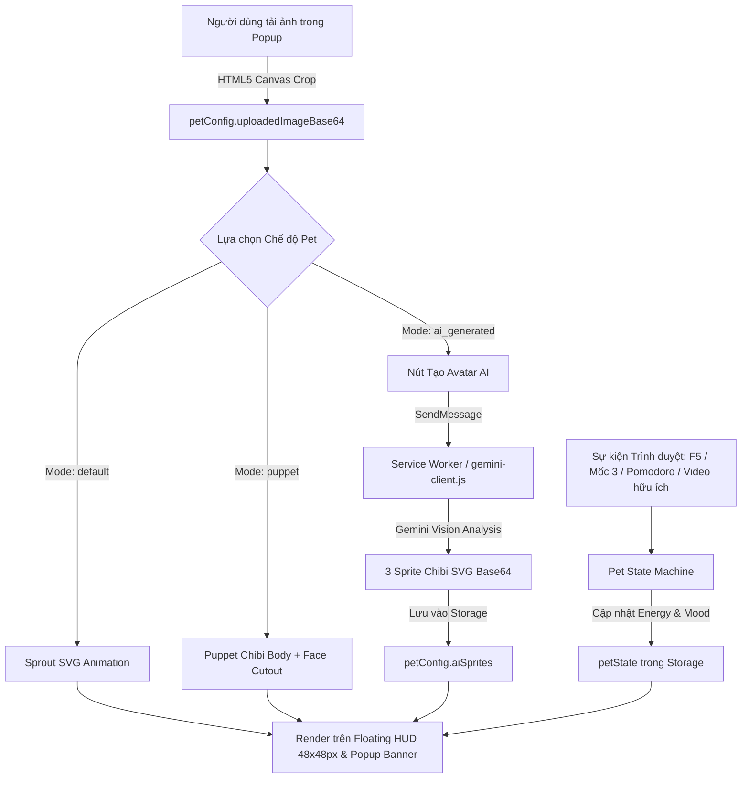

# Kế hoạch Triển Khai Chuyên Sâu: Hệ Thống Linh Vật Pet Đa Chế Độ & Gamification

## 1. Mục Tiêu (Goal Description)
Nâng cấp toàn diện module Linh vật ([pet-engine.js](file:///f:/A-PROJECTS/social-media-tracker/src/content/modules/pet-engine.js)), giao diện thiết lập tại [popup.html](file:///f:/A-PROJECTS/social-media-tracker/popup.html) & [popup.js](file:///f:/A-PROJECTS/social-media-tracker/popup.js), và hiển thị tương tác trên Floating HUD ([hud.js](file:///f:/A-PROJECTS/social-media-tracker/src/content/modules/hud.js)).

Hệ thống hỗ trợ **3 chế độ Pet linh hoạt**:
1. **`default` (Mầm cây Sprout / Pixel Pet):** Hoạt họa SVG thuần túy, phản ứng theo 3 trạng thái năng lượng (Nở hoa tươi tắn / Mầm sinh trưởng / Héo rũ ủ dột).
2. **`puppet` (Khung Puppet Ghép Mặt Cắt Dán Cục Bộ - 100% Offline):** Tải ảnh người dùng/đồ vật lên, xử lý trực tiếp bằng HTML5 Canvas cục bộ (Resize + Circular Center/Face Crop thành Base64 không gửi ra ngoài mạng). Ghép vào khung cơ thể chibi hoạt họa với các hiệu ứng CSS Animation động:
   - **Happy (≥ 70%):** Nhún nhảy (bounce), bắn tim/ngôi sao xung quanh.
   - **Neutral (40 - 69%):** Nhịp thở êm dịu, cử động nhẹ.
   - **Sad (< 40%):** Rung giật (tremble), chùng xuống, màng lọc grayscale và giọt mồ hôi rơi.
3. **`ai_generated` (AI Chibi Avatar 1 Lần Duy Nhất):** Gọi Gemini Vision API phân tích đặc trưng ảnh gốc người dùng để sinh ra bộ 3 sprite biểu cảm (Happy, Neutral, Sad) dạng SVG Data URI/Base64. Lưu cố định vào `petConfig.aiSprites` và chuyển đổi hiển thị mượt mà không tốn thêm bất kỳ token nào.

---

## 2. User Review Required

> [!IMPORTANT]
> **API Model Endpoint & Fallback cho Chế độ `ai_generated`:**
> Trong [gemini-client.js](file:///f:/A-PROJECTS/social-media-tracker/src/background/gemini-client.js), bạn vừa đổi URL endpoint sang `gemini-3.6-flash`. Hiện tại trên Google Generative AI REST API chính thức, tên model tiêu chuẩn là `gemini-1.5-flash` và `gemini-2.0-flash`. Để tránh lỗi `404 Model Not Found`, chúng ta sẽ thiết lập cơ chế gọi thông minh: ưu tiên endpoint người dùng cấu hình, nếu trả về lỗi model sẽ tự động fallback sang `gemini-1.5-flash`/`gemini-2.0-flash`.
> Ngoài ra, để sinh bộ 3 ảnh Chibi từ ảnh người dùng mà vẫn tận dụng được Free Tier của Gemini REST API, Gemini sẽ phân tích ảnh Base64 và sinh ra trực tiếp **3 hình ảnh Vector Chibi SVG biểu cảm** (Happy, Neutral, Sad) rồi mã hóa thành Base64 Data URI (`data:image/svg+xml;base64,...`). Cách này giúp ảnh sắc nét mọi kích thước, không tốn quota Imagen riêng biệt, và render trực tiếp 100% tương thích trình duyệt.

> [!NOTE]
> **Cấu trúc lưu trữ chuẩn hóa và tương thích ngược:**
> Sẽ lưu trữ 2 object chính trong `chrome.storage.local`:
> - `petConfig`: `{ mode: "default" | "puppet" | "ai_generated", uploadedImageBase64: "...", aiSprites: { happy, neutral, sad } }`
> - `petState`: `{ energy: 100, mood: "happy", currentStreak: 0, streakDays: 0, lastStreakDate: null }` (giữ kèm `streakDays` để tương thích hoàn toàn với [reflection.js](file:///f:/A-PROJECTS/social-media-tracker/src/reflection/reflection.js)).

---

## 3. Kiến Trúc & Luồng Dữ Liệu (Mermaid Diagram)



---

## 4. Chi Tiết Các File Cần Thay Đổi

### A. Giao diện Cài đặt Pet: `popup.html` & `popup.js`
#### [MODIFY] [popup.html](file:///f:/A-PROJECTS/social-media-tracker/popup.html)
- **Nâng cấp Banner Pet đầu trang:** Hiển thị Pet avatar linh hoạt theo chế độ (`default`, `puppet`, hoặc `ai_generated`) với kích thước 44x44px.
- **Thêm Card "Cấu hình Linh vật Pet (3 Chế độ)" trong Tab Cài đặt:**
  - **Radio Selector:** 3 tùy chọn rõ ràng có icon (`🌱 Mầm cây Mặc định`, `🎭 Khung Puppet Ghép Mặt`, `✨ AI Chibi Avatar`).
  - **Khu vực Upload Ảnh Cá Nhân:**
    - Khung kéo thả file (drag & drop) hoặc click chọn ảnh.
    - Khung xem trước hình tròn (Canvas circular crop preview 80x80px).
    - Hướng dẫn: "Ảnh được cắt tròn và nén cục bộ 100% bằng Canvas, bảo mật tuyệt đối".
  - **Khu vực Chế độ AI Chibi:**
    - Hiển thị nút `⚡ Tạo Avatar AI Chibi (3 Biểu cảm)` khi ở chế độ `ai_generated`.
    - Thanh tiến trình/thông báo trạng thái: Đang phân tích ảnh -> Đang vẽ 3 sprite (Happy, Neutral, Sad) -> Hoàn tất.
    - Hiển thị 3 sprite thu nhỏ (Happy, Neutral, Sad) đã tạo.

#### [MODIFY] [popup.js](file:///f:/A-PROJECTS/social-media-tracker/popup.js)
- Thêm logic xử lý HTML5 Canvas cục bộ:
  - Hàm `cropImageToCircle(imageFile, targetSize = 160)`: Đọc ảnh qua `FileReader`, tạo `Image`, tính toán Center/Face Crop vuông, vẽ lên Canvas hình tròn với antialiasing mịn, xuất ra Base64 JPEG chất lượng 85%, lưu vào `petConfig.uploadedImageBase64`.
- Lắng nghe chuyển đổi mode (`default` | `puppet` | `ai_generated`) và lưu vào `petConfig.mode`.
- Xử lý click nút `Tạo Avatar AI`:
  - Gửi message `{ type: "GENERATE_AI_PET_SPRITES", imageBase64 }` sang Service Worker.
  - Nhận về bộ 3 sprite `{ happy, neutral, sad }` và lưu vào `petConfig.aiSprites`.
- Cập nhật hàm `updatePetBanner()` hỗ trợ render cả 3 chế độ.

---

### B. Module Linh vật: `src/content/modules/pet-engine.js` & CSS Animation
#### [MODIFY] [pet-engine.js](file:///f:/A-PROJECTS/social-media-tracker/src/content/modules/pet-engine.js)
- **Cấu trúc lại `PetEngine`:**
  - Khởi tạo đọc cả `petState` và `petConfig`.
  - Quản lý State Machine chuẩn:
    - `energy`: 0 - 100.
    - `mood`: `happy` (≥ 70), `neutral` (40 - 69), `sad` (< 40).
  - **Quy tắc điều hòa Năng lượng:**
    - `penalize(amount = 15, reason)`:
      - `reload_spam`: giảm 5 điểm.
      - `impulsive_video` hoặc `milestone_3`: giảm 15 điểm.
    - `reward(amount = 10, reason)`:
      - `pomodoro_complete`: tăng 10 điểm.
      - `useful_video`: tăng 5 điểm.
    - Sau khi cộng/trừ năng lượng, tự động tính lại `mood` dựa trên ngưỡng:
      ```javascript
      if (this.energy >= 70) this.mood = "happy";
      else if (this.energy >= 40) this.mood = "neutral";
      else this.mood = "sad";
      ```
    - Đồng bộ `petState` vào `chrome.storage.local`.
- **Render Đa Chế Độ (Multi-mode Renderer):**
  - **1. Mode `default` (Mầm cây Sprout / Chibi Sprout):**
    - `happy`: Mầm cây nở hoa rực rỡ, lá rung rinh tươi vui, mắt cười híp.
    - `neutral`: Mầm cây 2 lá xanh mướt, nhịp thở êm đềm.
    - `sad`: Cây héo rũ, lá cụp xuống màu úa xám, giọt nước nhỏ giọt.
  - **2. Mode `puppet` (Khung Ghép Mặt Hoạt Họa):**
    - Khung cơ thể Chibi bằng SVG gọn gàng (tay, chân nhỏ, áo choàng hoặc thân gấu cute).
    - Ở vị trí đầu: Nhúng ảnh tròn `petConfig.uploadedImageBase64` qua thẻ `<image>` SVG hoặc `div` bo tròn.
    - Áp dụng các class CSS Animation:
      - `.mindful-puppet-happy`: Nhún nhảy bounce 1.2s lặp lại, hiệu ứng tim bay quanh.
      - `.mindful-puppet-neutral`: Breathing pulse nhẹ 2s.
      - `.mindful-puppet-sad`: Tremble rung lắc nhẹ, `filter: grayscale(0.5) contrast(0.9)`, giọt mồ hôi rơi trên góc trán.
  - **3. Mode `ai_generated`:**
    - Lấy sprite tương ứng từ `petConfig.aiSprites[this.mood]`.
    - Nếu chưa có sprite, tự động fallback hiển thị mode `puppet` hoặc `default`.
- **Kích thước hiển thị trên HUD:** Tối ưu kích thước nhỏ gọn 48x48px (hoặc container pill 64px), nằm gọn gàng bên góc trái HUD, không che mất các con số thống kê và không cản trở thao tác cuộn trên website.
- **Tiêm (Inject) CSS Animation:** Tự động inject khối style animation cô lập (`#mindful-pet-keyframes`) vào `document.head` nếu chưa có.

---

### C. Logic Phân Tích & Sinh Sprite AI trong Service Worker
#### [MODIFY] [gemini-client.js](file:///f:/A-PROJECTS/social-media-tracker/src/background/gemini-client.js)
- Thêm hàm `generateChibiPetSprites(imageBase64, apiKey)`:
  - Gửi ảnh Base64 sang Gemini Vision API.
  - Prompt yêu cầu:
    > "Analyze this avatar image (identify gender/character/object, key colors, hair style, glasses/accessories). Generate 3 cute, clean chibi avatar vector illustrations in SVG format representing 3 moods: Happy (joyful, smiling), Neutral (calm, focused), Sad (droopy eyes, tear drop). Return strictly a JSON object: {"happy": "<svg viewBox='0 0 100 100' ...>...</svg>", "neutral": "<svg ...>...</svg>", "sad": "<svg ...>...</svg>"}."
  - Chuyển đổi mã nguồn SVG nhận được thành Base64 Data URI sạch (`data:image/svg+xml;base64,...`) để lưu trữ nhẹ nhàng và render tức thì.
  - Cơ chế fallback linh hoạt model (`gemini-1.5-flash` / `gemini-2.0-flash`) nếu URL người dùng cài đặt gặp vấn đề về phiên bản.

#### [MODIFY] [service-worker.js](file:///f:/A-PROJECTS/social-media-tracker/src/background/service-worker.js)
- Lắng nghe message `GENERATE_AI_PET_SPRITES`:
  - Lấy API Key từ `chrome.storage.local`.
  - Gọi `generateChibiPetSprites(msg.imageBase64, apiKey)`.
  - Lưu kết quả vào `petConfig.aiSprites` và trả về `sendResponse({ ok: true, sprites })`.
- Đảm bảo khởi tạo cấu trúc `petConfig` mặc định khi cài extension:
  ```json
  "petConfig": {
    "mode": "default",
    "uploadedImageBase64": "",
    "aiSprites": {}
  }
  ```

#### [MODIFY] [content-core.js](file:///f:/A-PROJECTS/social-media-tracker/src/content/content-core.js)
- Chuẩn hóa các điểm phạt và thưởng năng lượng theo đúng đặc tả:
  - Khi hoàn thành Pomodoro Focus session: `petEngine?.reward(10, "pomodoro_complete")`.
  - Khi xem video hữu ích ≥ 80%: `petEngine?.reward(5, "useful_video")`.
  - Khi F5 liên tục: `petEngine?.penalize(5, "reload_spam")`.
  - Khi bỏ dở video hoặc chạm Mốc 3: `petEngine?.penalize(15, "milestone_3")`.

---

## 5. Kế Hoạch Kiểm Thử (Verification Plan)

### A. Kiểm thử Thủ công (Manual Verification Steps):
1. **Kiểm tra Chế độ Mầm cây Mặc định (`default`):**
   - Mở Popup -> Chọn chế độ `default`.
   - Mở YouTube -> Xem Linh vật mầm cây trên HUD.
   - Thử nghiệm 3 mức năng lượng:
     - 100% (Happy): Mầm cây tươi tắn nở hoa.
     - 55% (Neutral): Mầm cây 2 lá xanh.
     - 25% (Sad): Cây héo rũ, ủ dột.
2. **Kiểm tra Chế độ Khung Puppet Ghép Mặt Cắt Dán (`puppet`):**
   - Trong Popup -> Chọn `puppet`.
   - Chọn tải lên 1 tấm ảnh chân dung hoặc đồ vật bất kỳ (PNG/JPG).
   - Kiểm tra ảnh tự động được Canvas cắt tròn chuẩn xác và hiển thị trên bản xem trước.
   - Bấm lưu và kiểm tra trên YouTube HUD: Khung cơ thể hoạt họa ghép mặt ảnh tròn, nhún nhảy khi Happy, rung lắc và chuyển grayscale khi Sad.
3. **Kiểm tra Chế độ AI Chibi Avatar (`ai_generated`):**
   - Trong Popup -> Chọn `ai_generated`.
   - Bấm nút `Tạo Avatar AI Chibi` -> Kiểm tra Service Worker gọi Gemini Vision xử lý ảnh.
   - Kiểm tra 3 sprite SVG được sinh ra và lưu trữ thành công.
   - Kiểm tra tráo đổi mượt mà giữa 3 sprite theo năng lượng mà không sinh thêm bất kỳ lượt gọi API nào.
4. **Kiểm tra State Machine & Đồng bộ Storage:**
   - Bấm F5 liên tục 3 lần: Kiểm tra năng lượng giảm đúng 5 điểm.
   - Bỏ dở video hoặc chạm Mốc 3: Kiểm tra năng lượng giảm đúng 15 điểm.
   - Hoàn thành 1 chu kỳ Pomodoro hoặc xem video học tập ≥ 80%: Kiểm tra năng lượng tăng tương ứng (+10 và +5).
   - Mở lại Popup: Xác nhận thanh Năng lượng và Chuỗi Streak đồng bộ tức thì.
