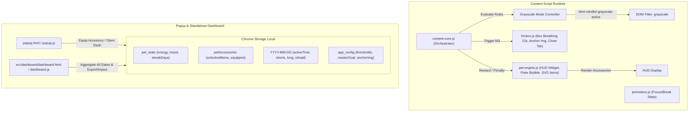

# Kế Hoạch Triển Khai Hoàn Tất Giai Đoạn 4 & Thực Hiện Giai Đoạn 5

Tài liệu thiết kế kỹ thuật chi tiết nhằm hoàn thiện 100% Giai đoạn 4 và xây dựng toàn diện Giai đoạn 5 cho Tiện ích mở rộng Mindful Social Media Tracker (Manifest V3).

---

## 1. Mục Tiêu Tổng Thể (Goal Description)

1. **Nâng cấp Pet Engine (`src/content/modules/pet-engine.js` & `popup`):**
   - Hỗ trợ tương tác Poke/Click vào Pet trên HUD: Hiển thị bóng thoại (Speech Bubble) nhắc nhở thể chất (uống nước, hít thở, chớp mắt, mục tiêu lớn) tự ẩn sau 4 giây.
   - Cơ chế Cooldown thông minh: Mỗi 30 phút chỉ cộng tối đa +3 năng lượng 1 lần để chống spam click.
   - Hệ thống phụ kiện mở rộng (Modular Items): Schema lưu trữ `unlockedItems`, `equipped: { head, body }`. Tự động mở khóa Kính râm cực ngầu (Streak $\ge$ 3 ngày) và Vòng nguyệt quế/Mầm hoa (Streak $\ge$ 7 ngày), vẽ layer SVG phủ lên Pet ở cả 3 chế độ (Sprout, Puppet, AI).
2. **Kích hoạt Chế độ Đen Trắng (Grayscale Demotivation Mode):**
   - Tự động áp dụng filter `filter: grayscale(100%) !important; transition: filter 0.5s ease;` lên toàn bộ trang Facebook / YouTube khi:
     - (a) Đang trong phiên Pomodoro Focus (`pomodoroManager.isFocusSession`).
     - (b) Vượt Mốc cảnh báo 2 (`currentCount >= m2Limit`).
     - (c) Khung giờ đêm sau 22h30 hoặc trước 05h00 sáng.
3. **Bài tập Thở Box Breathing trên Màn hình Ngắt nhịp (`src/content/modules/friction.js`):**
   - Thay thế cơ chế giữ phím Space 3s bằng bài tập thở Box Breathing 1 chu kỳ chuẩn (12 giây: Hít vào 4s $\rightarrow$ Giữ hơi 4s $\rightarrow$ Thở ra 4s) với vòng tròn hoạt họa co giãn mượt mà 60fps.
   - Đặt ảnh người thương / mỏ neo cảm xúc ở vị trí trung tâm trang trọng cùng thông điệp cổ vũ từ mục tiêu lớn.
   - Bắt buộc thở xong 12s mới mở khóa nút "Tiếp tục (5 lượt hoãn)", kèm nút bấm "Đóng tab ngay" để người dùng thoát mạng xã hội tức thì.
4. **Trang Báo cáo Phân tích Dài hạn (`src/dashboard/dashboard.html` & `dashboard.js`):**
   - Trang báo cáo giao diện Glassmorphism độc lập, mở từ Popup.
   - Thống kê & biểu đồ xu hướng 7 ngày / 30 ngày vẽ bằng HTML5 Canvas thuần: Tổng thời gian lướt, số lượt xem Shorts/Reels, số lần F5, và tỷ lệ % nội dung mục tiêu.
   - Nút "Xuất dữ liệu (Export JSON)" tải file sao lưu về máy và nút "Khôi phục dữ liệu (Import JSON)" đọc file JSON kiểm tra tính hợp lệ rồi nạp lại vào storage.

---

## 2. Kiến Trúc Luồng Dữ Liệu & Tương Tác (Architecture)



---

## 3. Chi Tiết Các Thay Đổi Cụ Thể (Proposed Changes)

### Component 1: Nâng Cấp Pet Engine & Hệ Thống Phụ Kiện

#### [MODIFY] [pet-engine.js](file:///f:/A-PROJECTS/social-media-tracker/src/content/modules/pet-engine.js)
- Thêm cấu trúc `accessories: { unlockedItems: [], equipped: { head: null, body: null } }` vào `this.accessories`.
- Tự động kiểm tra Streak khi khởi tạo hoặc khi storage thay đổi:
  - Nếu `streakDays >= 3` $\rightarrow$ Thêm `"sunglasses"` vào `unlockedItems`.
  - Nếu `streakDays >= 7` $\rightarrow$ Thêm `"laurel"` vào `unlockedItems`.
- **Hàm render layer phụ kiện:**
  - `_renderAccessoryHead(size)`:
    - `"sunglasses"`: Vẽ cặp kính râm đen bóng gradient bo cong cực ngầu ngang vị trí mắt (`<path fill="#0F172A" ...>`).
    - `"laurel"`: Vẽ vòng lá nguyệt quế vàng óng viền xanh bao quanh đỉnh đầu mầm cây / đầu avatar (`<path fill="#F59E0B" ...>`).
  - Tích hợp layer phụ kiện vào cả 3 hàm render: `_renderDefaultSprout`, `_renderPuppet`, và `_renderAiSprite`.
- **Sự kiện Poke / Click:**
  - Thêm phương thức `handlePoke()` gắn vào click của `#mindful-pet-widget`.
  - Hiển thị Speech Bubble trôi nhẹ lên trên Pet với danh sách lời nhắc thay đổi ngẫu nhiên:
    - 💧 *"Uống một ngụm nước ấm nhé!"*
    - 🌬️ *"Thả lỏng vai và hít thở sâu 3 nhịp nào!"*
    - 🎯 *"Nhớ mục tiêu lớn của bạn hôm nay!"*
    - 👀 *"Nhìn ra xa 6 mét trong 20 giây để thư giãn mắt!"*
    - 🧘 *"Ngồi thẳng lưng lên một chút bạn ơi!"*
  - **Auto-hide:** Dùng `clearTimeout` và `setTimeout` để tự gỡ bóng thoại sau đúng 4.0 giây (Rule 2).
  - **Cooldown Năng Lượng:** Kiểm tra `lastPokeEnergyTime`. Nếu `now - lastPokeEnergyTime >= 30 * 60 * 1000`:
    - Thưởng `+3` năng lượng, cập nhật `lastPokeEnergyTime`.
    - Thêm huy hiệu mini `+3⚡` bay lên cùng hiệu ứng ăn mừng vui nhộn.
    - Nếu chưa hết 30 phút cooldown: Pet vẫn hiển thị bóng thoại và lắc lư đáng yêu nhưng không cộng dồn năng lượng.

#### [MODIFY] [popup.html](file:///f:/A-PROJECTS/social-media-tracker/popup.html) & [popup.js](file:///f:/A-PROJECTS/social-media-tracker/popup.js)
- Thêm mục **"Tủ Đồ Phụ Kiện (Streak Wardrobe)"** trong Card Cài đặt Linh vật:
  - Hiển thị danh sách item:
    1. 😎 **Kính Râm Sành Điệu**: Yêu cầu Streak $\ge$ 3 ngày. Nút [Đeo] / [Tháo].
    2. 🌿 **Vòng Nguyệt Quế**: Yêu cầu Streak $\ge$ 7 ngày. Nút [Đeo] / [Tháo].
  - Hiển thị trạng thái "🔒 Cần đạt Streak X ngày" nếu chưa đủ điều kiện.
  - Khi người dùng click Đeo/Tháo: Cập nhật `chrome.storage.local.set({ petAccessories })`, Pet trên HUD và Avatar trong Popup lập tức khoác phụ kiện tương ứng.

---

### Component 2: Chế Độ Đen Trắng (Grayscale Demotivation Mode)

#### [MODIFY] [content-core.js](file:///f:/A-PROJECTS/social-media-tracker/src/content/content-core.js)
- Xây dựng cơ chế kiểm tra điều kiện Grayscale tập trung `evaluateGrayscaleMode()`:
  ```javascript
  function evaluateGrayscaleMode() {
    const isPomodoroFocus = pomodoroManager?.isFocusSession || false;
    
    const { shorts: shortThresh, long: longThresh } = getThresholds();
    let currentCount = 0;
    let m2Limit = 30;
    if (isYT) {
      currentCount = location.pathname.startsWith("/shorts") 
        ? (dayData.youtube?.shortVideos?.totalSwipes || 0)
        : (dayData.youtube?.longVideos?.totalWatched || 0);
      m2Limit = location.pathname.startsWith("/shorts") ? shortThresh.m2 : longThresh.m2;
    } else if (isFB) {
      currentCount = location.pathname.includes("/reel")
        ? (dayData.facebook?.reels?.totalSwipes || 0)
        : (dayData.facebook?.summary?.feedPostsScrolled || 0);
      m2Limit = shortThresh.m2;
    }
    const isOverM2 = currentCount >= m2Limit;

    // Giờ đêm sau 22h30 hoặc trước 05h00
    const now = new Date();
    const currentMins = now.getHours() * 60 + now.getMinutes();
    const isLateNight = currentMins >= (22 * 60 + 30) || currentMins < (5 * 60);

    const shouldGrayscale = isPomodoroFocus || isOverM2 || isLateNight;
    
    const htmlEl = document.documentElement;
    if (shouldGrayscale) {
      if (!htmlEl.classList.contains("mindful-grayscale-active")) {
        htmlEl.classList.add("mindful-grayscale-active");
      }
    } else {
      if (htmlEl.classList.contains("mindful-grayscale-active")) {
        htmlEl.classList.remove("mindful-grayscale-active");
      }
    }
  }
  ```
- CSS chèn vào `<head>` đảm bảo chuyển đổi êm mượt, không giật màn hình:
  ```css
  html.mindful-grayscale-active {
    filter: grayscale(100%) !important;
    transition: filter 0.5s ease-in-out !important;
  }
  ```
- Gọi `evaluateGrayscaleMode()` tại các thời điểm:
  1. Khi khởi động xong `loadAppData`.
  2. Mỗi khi số lượt lướt tăng (`onAction`).
  3. Khi đổi trang / đổi tab SPA (`onRouteChanged`).
  4. Mỗi khi Pomodoro thay đổi trạng thái tick.
  5. Đặt một bộ đếm `setInterval` chu kỳ 30 giây để đón đúng mốc 22h30 ban đêm.

---

### Component 3: Bài Tập Thở Box Breathing trên Friction Overlay

#### [MODIFY] [friction.js](file:///f:/A-PROJECTS/social-media-tracker/src/content/modules/friction.js)
- Thiết kế lại toàn bộ giao diện của `showHardFriction(currentCount, m3Limit, unitLabel)`:
  - **Vị trí Trung Tâm:**
    - Tấm ảnh cá nhân / mỏ neo cảm xúc với khung viền phát sáng dịu mắt (Soft Glow).
    - Lời nhắc cổ vũ: *"Hít thở chậm lại. Người ấy và tương lai đang chờ bạn."* cùng nội dung `masterGoal`.
  - **Box Breathing Widget (Vòng Tròn Hướng Dẫn Thở):**
    - Vòng tròn SVG / Canvas động có đường kính 160px với hiệu ứng nhịp thở 12 giây:
      - **Pha 1 (0s - 4s): Hít vào** (Inhale) $\rightarrow$ Vòng tròn từ từ nở rộng từ kích thước 0.8x lên 1.3x kèm màu xanh Cyan thư thái (`#06B6D4`). Text: *"Hít vào thật sâu bằng mũi..."*.
      - **Pha 2 (4s - 8s): Giữ hơi** (Hold) $\rightarrow$ Vòng tròn duy trì kích thước tối đa, phát xung nhẹ ánh tím (`#8B5CF6`). Text: *"Giữ hơi thở và thư giãn..."*.
      - **Pha 3 (8s - 12s): Thở ra** (Exhale) $\rightarrow$ Vòng tròn từ từ thu nhỏ lại về 0.8x với ánh xanh ngọc dịu (`#10B981`). Text: *"Thở ra chậm rãi bằng miệng..."*.
    - Vòng cung tiến độ (Circular Progress Ring) chạy mượt mà từ 0% đến 100% trong 12s.
  - **Hành Động Người Dùng:**
    - Nút **"🛑 Rời khỏi mạng xã hội ngay"**: Nổi bật nhất, click vào đóng ngay tab (`window.close()`) hoặc chuyển về trang học tập / trang trắng.
    - Nút **"Tiếp tục (5 lượt hoãn)"**: Khóa (`disabled`), chỉ tự động mở sáng rực rỡ khi hoàn thành đủ 1 chu kỳ 12s. Khi click, cấp 5 lượt hoãn và đóng overlay.

---

### Component 4: Trang Báo Cáo Phân Tích Dài Hạn & Sao Lưu Dữ Liệu

#### [NEW] [dashboard.html](file:///f:/A-PROJECTS/social-media-tracker/src/dashboard/dashboard.html)
- Giao diện chuẩn Glassmorphism đồng bộ với `reflection.html`:
  - **Header:** Logo Mindful Tracker, Tiêu đề "Báo Cáo Phân Tích Xu Hướng & Hành Vi", nút chuyển khoảng thời gian (7 Ngày qua / 30 Ngày qua).
  - **Hàng Chỉ Số Tổng Quan (Metric Cards):**
    1. Tổng thời gian lướt (Active vs Passive).
    2. Trung bình thời gian mỗi ngày.
    3. Tổng số video Shorts/Reels & Tần suất F5 reload.
    4. Tỷ lệ % Nội dung Mục tiêu & Bổ ích.
  - **Biểu Đồ Xu Hướng (HTML5 Canvas Charts):**
    - Biểu đồ Cột / Đường: Thời gian lướt và số lần lướt Shorts theo ngày.
    - Biểu đồ Tỷ lệ: % Hoàn thành mục tiêu qua từng ngày (Trendline tiến bộ).
    - Biểu đồ Radar/Bar: Tần suất F5 / Spam tải lại trang theo ngày.
  - **Khu Vực Sao Lưu & Khôi Phục (Backup & Restore):**
    - Nút `📥 Xuất Dữ Liệu (Export JSON)`: Tải xuống toàn bộ nhật ký và cấu hình dưới định dạng JSON có timestamp.
    - Nút `📤 Khôi Phục Dữ Liệu (Import JSON)` kèm input file ẩn: Đọc file JSON, kiểm tra tính hợp lệ dữ liệu, xác nhận và cập nhật vào `chrome.storage.local`.

#### [NEW] [dashboard.js](file:///f:/A-PROJECTS/social-media-tracker/src/dashboard/dashboard.js)
- Quét toàn bộ các key dạng `YYYY-MM-DD` trong `chrome.storage.local`.
- Lọc theo dải ngày 7 ngày hoặc 30 ngày gần nhất.
- Vẽ Canvas biểu đồ sắc nét (xử lý `window.devicePixelRatio` chống nhòe trên màn Retina/HiDPI).
- Module xử lý Export JSON: tạo `Blob`, tạo link `a.download`, kích hoạt tải về file `mindful-tracker-backup-YYYY-MM-DD.json`.
- Module xử lý Import JSON: `FileReader.readAsText()`, kiểm tra schema bảo mật, hiển thị modal xác nhận trước khi ghi đè storage, thông báo toast hoàn tất.

#### [MODIFY] [popup.html](file:///f:/A-PROJECTS/social-media-tracker/popup.html) & [popup.js](file:///f:/A-PROJECTS/social-media-tracker/popup.js)
- Thêm nút `📊 Dashboard` trong Footer cạnh nút `📝 Phản Tư`.
- Xử lý mở tab `dashboard.html` thông qua `chrome.tabs.create`.

#### [MODIFY] [manifest.json](file:///f:/A-PROJECTS/social-media-tracker/manifest.json) & [service-worker.js](file:///f:/A-PROJECTS/social-media-tracker/src/background/service-worker.js)
- Thêm `src/dashboard/dashboard.html` và `src/dashboard/dashboard.js` vào `web_accessible_resources`.
- Bổ sung message handler `OPEN_DASHBOARD` trong service worker.

---

## 4. Kế Hoạch Kiểm Thử (Verification Plan)

### Kiểm Thử Tự Động (Syntax & Module Check)
Chạy cú pháp kiểm tra ES Module trên Node.js để đảm bảo không có lỗi parse hoặc cú pháp:
```powershell
node --check src/content/modules/pet-engine.js
node --check src/content/modules/friction.js
node --check src/content/content-core.js
node --check popup.js
node --check src/dashboard/dashboard.js
node --check src/background/service-worker.js
```

### Bảng Kịch Bản Kiểm Thử Thủ Công (Manual Verification)

| STT | Tính Năng | Thao Tác Thực Hiện | Kết Quả Mong Đợi |
|:---:|:---|:---|:---|
| **1** | **Pet Poke & Cooldown** | Click vào Pet trên HUD ở góc màn hình YouTube/Facebook. Click liên tục nhiều lần. | Bóng thoại hiện lời nhắc ngẫu nhiên, tự biến mất sau 4s. Chỉ lần đầu được +3 năng lượng (nếu chưa full), các click sau trong 30 phút không cộng dồn. |
| **2** | **Pet Phụ Kiện (Wardrobe)** | Giả lập Streak = 3 và Streak = 7 trong Storage hoặc qua Popup. Bấm Đeo Kính râm / Vòng nguyệt quế. | Pet trên HUD và trong Popup ngay lập tức được vẽ thêm kính râm đen ngầu hoặc vòng nguyệt quế vàng óng. |
| **3** | **Grayscale Mode** | 1. Bật phiên Pomodoro Focus<br>2. Đạt ngưỡng Mốc 2<br>3. Chỉnh giờ hệ thống sang 23h00. | Toàn bộ trang chuyển dần sang đen trắng trong 0.5s mượt mà. Khi tắt Pomodoro hoặc hết giờ đêm, màu sắc trở lại bình thường. |
| **4** | **Box Breathing Overlay** | Vượt mốc 3 (Trần đỏ). Quan sát màn hình ngắt nhịp. | Vòng tròn dẫn nhịp thở Hít (4s) $\rightarrow$ Giữ (4s) $\rightarrow$ Thở (4s). Nút "Tiếp tục" chỉ mở sau 12s. Nút "Rời khỏi mạng xã hội" đóng tab thành công. |
| **5** | **Dashboard & Export/Import** | Bấm nút "📊 Dashboard" trên Popup. Xem biểu đồ 7/30 ngày. Bấm Xuất JSON rồi thử Nhập JSON. | Trang mở trong tab mới, biểu đồ Canvas hiển thị số liệu trực quan. File JSON tải về máy đầy đủ lịch sử, import lại thành công không mất dữ liệu. |
